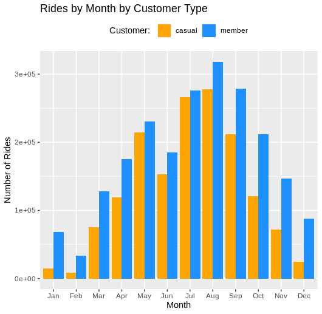
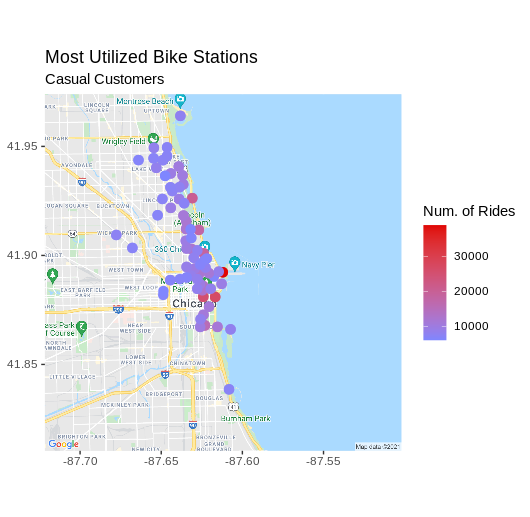

 

### A Case Study: How Does a Bike-Share Navigate Speedy Success?
 

  

#### Google Data Analyst Certification Capstone Project
 

>**Background**  
This project involves a fictional bike-share company, Cyclistic. The data used for analysis is publicly available from divvy, the real-world city of Chicago bike-share operator.
 

>**Objective**    
Maximize the number of annual subscriptions by turning casual customers into members. The specific goal of this project is to **understand how casual riders and annual members use Cyclistic bikes differently.** 
 

Programming language and libraries used:
* R
* tidyverse
* janitor
* lubridate
* geosphere
* ggmap
* RColorBrewer
 

 

See the [notebook](https://nbviewer.jupyter.org/github/jdgimlin/google_capstone/blob/main/cyclistic_notebook.nb.html) file for all the code and complete analysis.
 

Or view the [presentation](https://github.com/jdgimlin/google_capstone/blob/main/Cyclistic_Presentation.pdf) for an overview and summary analysis.
 

